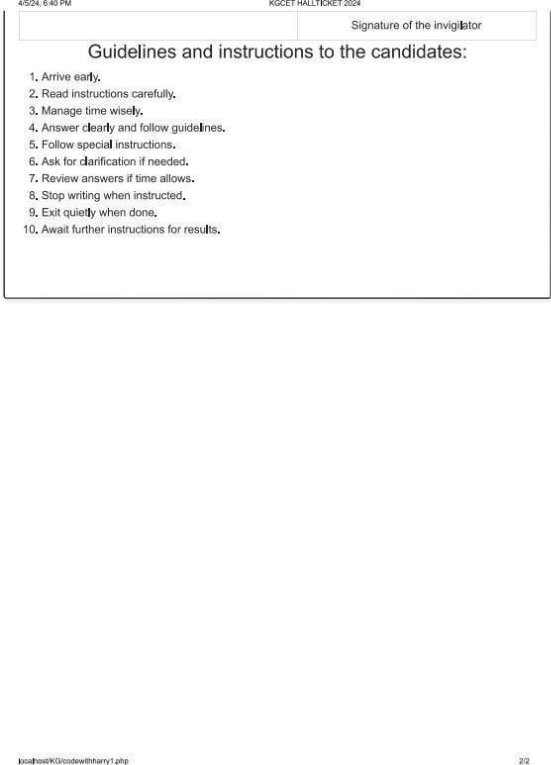
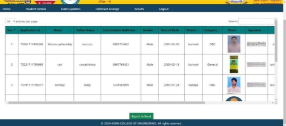

# Online-Registration-for-KGCET

**Final year college project**

<h2>

**Content**

<a href="#introduction">Introduction</a>

<a href="#install">How to Install and Run the Project</a> 

<a href="#diagrams">Diagrams</a> 

<a href="#screenshots">Here are a few screenshots illustrating my projects</a> 

<a href="#credits">Credits</a> 

</h2>

<h2 id="introduction">INRODUCTION</h2>
  
KGCET (Kandula Group of Common Entrance Test) Online Registration , a comprehensive platform designed to facilitate every aspect of the examination process for prospective students aiming to secure a seat in KSRM College of Engineering.
 
 
In the dynamic landscape of higher education admissions, the Online Registration for KGCET stands as a beacon of efficiency, transparency, and accessibility. Developed specifically for students completing their intermediate studies and aspiring to join KSRM College of Engineering, this system encompasses registration, hall ticket issuance, result publication, and administrative tools tailored to streamline the examination process.
 
 
Key Components of the Online Registration for KGCET:

**Registration Portal:** Empowering aspiring students to register seamlessly for the KGCET examination, providing a user-friendly interface to input their details and preferences securely.
 
**Hall Ticket Management:** A dedicated administrative interface enables authorized personnel to manage hall ticket generation efficiently, ensuring accurate distribution to registered candidates.
 
**Examination Conduct:** Leveraging the intranet infrastructure, the system facilitates the smooth administration of the KGCET examination, adhering to established guidelines and protocols.
 
**Result Publication:** Upon completion of the examination, results are promptly processed and published through the intranet system, providing candidates with timely access to their performance.
 
**Administrative Tools:** Robust administrative features empower authorized personnel to oversee the entire examination process, including monitoring registrations, managing hall tickets, and ensuring compliance with regulatory requirements.

 

**Domain Description**

“ONLINE REGISTRATION FOR KGCET “domain:

Administrator Interface:

•	Two primary forms: one for authorized login, and the other for administrative activities.

•	Access to administrator level with a valid username and password.

•	Activities include viewing detailed student information, updating important dates, adding questions, and performing various operations.

**Student Interface:**

•	Important Dates section provides crucial information on exam schedules, registration deadlines, hall ticket release, and results announcement.

•	Seamless registration process with essential details like name, date of birth, email, and uploading a passport-size photo.

•	Unique reference ID assigned upon successful registration for easy identification.

•	Convenient features like Download Registration Form and Downloading Hall Tickets using reference ID.

•	User-friendly website for efficient result inquiries using hall ticket number and date of birth.

**Proposed Solution**

•	Online Registration for KGCET enhance educational quality with supervised assessments for self-paced learning.

•	The portal enables administrators to seamlessly create, manage, and administer exams.

•	Developed for KSRM College, the web-based system reduces examination staff burden.

**ADVANTAGES:**

•	In Proposed System, Candidates can register for exam through online.

•	Students can register by giving their intermediate hall ticket number and uploading their passport size photo and date of birth etc.

•	Once the registration is completed students can print their application.

•	Student Can see exam registration start date, registration end date, Exam Date and Result Date.

•	Generates Student exam allocation date and time within very less time.

•	Students Can download their Hall ticket through online and students are to bring their hall tickets while coming to exam.

 

<h2 id="install">How to Install and Run the Project<h2>

<h3>

• First, clone the repository or download the zip file.

• If you downloaded the zip file, unzip it.

• If you have XAMPP installed, copy the unzipped folder into the "htdocs" directory. If you don't have XAMPP, you can download it from SourceForge (https://sourceforge.net/projects/xampp/).

• Start XAMPP and launch Apache and MySQL (If you are already u sing a MySQL application, stop the MySQL server by pressing Windows + R, typing services.msc, finding "MySQL" in the list, right-clicking on it, and selecting "Stop.").

• Open the MySQL admin panel.
    
    • Click on "New" and create a database named "lokesh".
    • Select the "lokesh" database and import the database.sql file from the unzipped folder or cloned repository.

• Then, open any browser and enter the following URLs in the search bar:

    • For Student Module: http://localhost/KG/
    • For Admin Module: http://localhost/KG/admin_module/

</h3>

<h2 id="diagrams">Diagrams<h2>

**System Architechture Diagram**

**Use Case Diagram**

**Class Diagram**

  
<h2 id="screenshots">Here are a few screenshots illustrating my projects</h2>
  

**Home Page**

  

**Registration Form Page**

  

**Registration Form Successful with reference ID Page**

  

**Print Application Form Page**

  

**Registration Form view and download page**

  

**Hall ticket Download Form page**

  

  
**Hall ticket Page**

  

**Results Download Page**

  

**About Us Page**

  

**Important Dates Page**

  

**Contact Us Page**

  

**Admin Login Page**

  

**Admin Home Page**

  

**Total Registration Students Page**

  

**Scheduled Students List Page**

  

**Edit Date and Time Page**

  

**All Students Details with Actions Page**

  

**Important Dates Update by Admin Page**

  

**Assigning Exam Date and Time Page**

  

**Uploading Results via CSV file and View Results Page**

  

**View Results Page**

  

**Admin Reset Password Form Page**

<h2 id="credits">Credits</h2>

• UMMADI DEEKSHA PHANEENDRA REDDY (209Y1A05H4)

• SYED SYED AMMAJI (209Y1A05G7)

• SUDDULA RAVIKRISHNA (209Y1A05G3)

• YARRANI LOKESH (209Y1A05I6)

• KUPPANI SAIKIRAN (2195YA0509)

We are a final year project team from Kandula Sreenivasa Reddy Memorial College of Engineering (Kadapa,Andhra Pradesh), 2020 - 2024 batch, CSE stream.